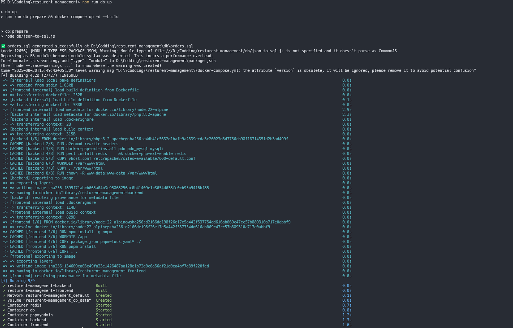
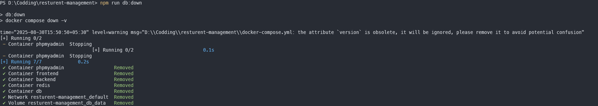
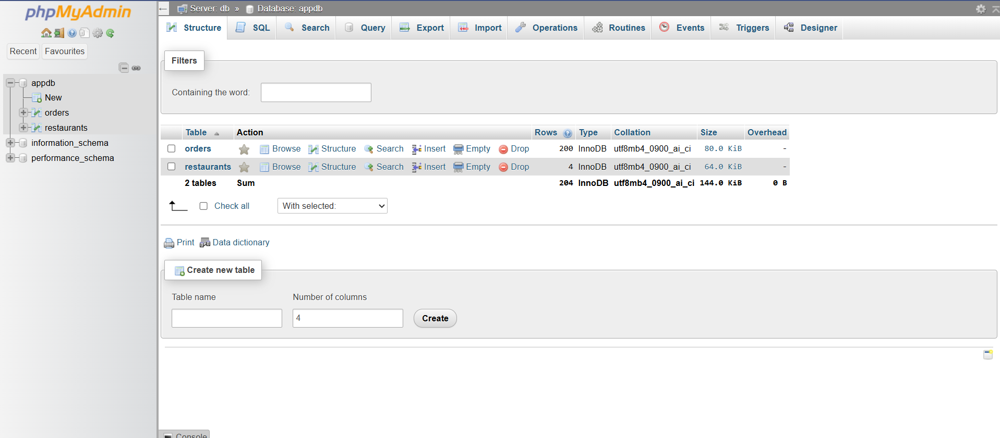
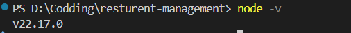
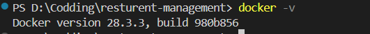

# 🍽️ Restaurant Order Trends – Full-Stack Assignment

### 📊 Restaurant Orders API (PHP + MySQL + Redis + Docker)

This project is a **Dockerized REST API** that manages **restaurants** and **orders**, built with:

- **PHP 8.2 (Apache)**
- **MySQL 8.0**
- **Redis 7.4** (for caching)
- **Docker & Docker Compose**
- **React.js (Frontend)**

It demonstrates how to integrate a **PHP backend** with **MySQL** while using **Redis caching** to improve performance.  

---

## 📌 Features
- ✅ PHP 8.2 with Apache in Docker
- ✅ MySQL for data persistence
- ✅ Redis for caching responses
- ✅ REST API endpoints for restaurants & orders
- ✅ CORS enabled (React)
- ✅ Pagination for orders
- ✅ Debug info showing whether data came from **MySQL** or **Redis**

---

## ⚙️ Tech Stack

| Layer          | Technology         |
|----------------|--------------------|
| **Language**   | PHP 8.2            |
| **Framework**  | Native PHP (no framework) |
| **Frontend**   | React.js           |
| **Database**   | MySQL 8.0          |
| **Cache**      | Redis 7.4          |
| **Server**     | Apache (PHP Docker)|
| **Container**  | Docker & Docker Compose |

---

## 🚀 Setup & Run

### 1️⃣ Clone the repository
```bash
git clone https://github.com/badmansp420/restaurant-analytics-dashboard-with-php.git
cd restaurant-analytics-dashboard-with-php
````

---

### 2️⃣ Environment Variables

Create a `.env` file in the project root with the following:

```env
# Database configuration
MYSQL_ROOT_PASSWORD=supersecretroot
MYSQL_DATABASE=appdb
MYSQL_USER=appuser
MYSQL_PASSWORD=apppass
MYSQL_HOST=db
```

---

### 3️⃣ Project Structure

```plaintext
├── backend
│   ├── public
│   │   ├── index.php
│   │   └── .htaccess 
│   ├── services
│   │   ├── OrderService.php
│   │   └── RestaurantsService.php
│   ├── config.php
│   ├── Dockerfile
│   └── vhost.conf
├── db
├── frontend   # React.js client
├── .env
├── docker-compose.yml
├── package.json
└── README.md
```

---

## 🖥️ System Requirements

Before starting, install:

* **Docker** (latest version)
* **Docker Compose**
* **Node.js v22+**
* **npm** (comes with Node.js)

---

## 📦 Scripts

### ▶️ Start Project

```bash
npm run db:up
```

📸 Example: Running the project


---

### ⏹ Stop Project

```bash
npm run db:down
```

📸 Example: Stopping containers



---

## 🔌 Running Services & Ports

| Service                 | Port     | Description            |
| ----------------------- | -------- | ---------------------- | 
| Client (React/Frontend) | **3000** | Frontend Application   | 
| Backend (PHP)           | **8080** | API / Backend Server   | 
| phpMyAdmin              | **8081** | Database Management UI | 
| Redis                   | **6379** | Caching Layer          | 
| MySQL Database          | **3306** | Main Database          | 

📸 Example: Running containers in Docker Desktop


---

## ⚡ Workflow

1. Run `npm run db:up` → Prepares database & starts Docker containers.
2. Access services:

   * 🌐 Frontend → [http://localhost:3000](http://localhost:3000)
   * 🔧 Backend → [http://localhost:8080](http://localhost:8080)
   * 🗄️ phpMyAdmin → [http://localhost:8081](http://localhost:8081)
3. Stop all containers with:

   ```bash
   npm run db:down
   ```

📸 Example: Accessing phpMyAdmin


---

## 📸 Screenshots (Full Project)

- **Node.js Version**
  

- **Docker Info**
  

- **Start Project**
  

- **Stop Project**
  

- **Docker Containers**
  

- **phpMyAdmin**
  


## 🎥 Demo Video

👉 [Google Drive Link – Project Demo](https://drive.google.com/file/d/1kAmr8b6MIkVou1vWyK9tfBQ4D6_9FCgL/view?usp=sharing) 


---

## 🙏 Thank You  

Thank you for exploring this project! 🚀    

Happy Coding! 💻✨